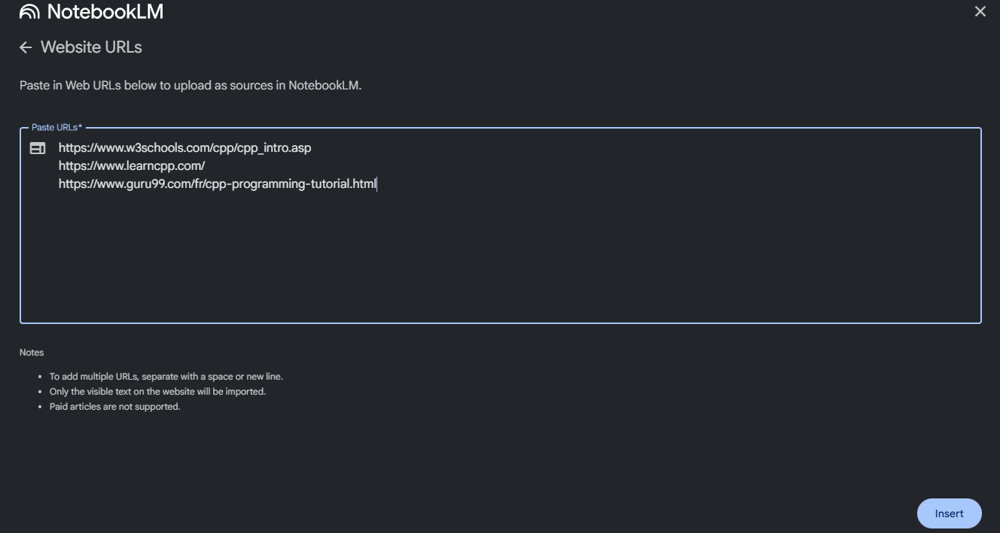
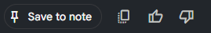
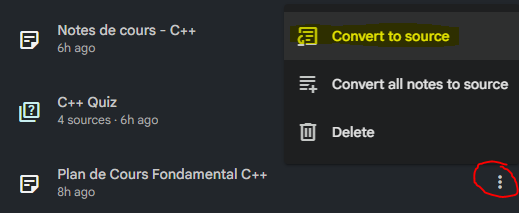
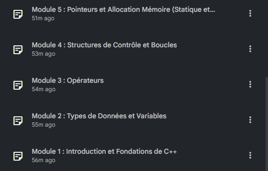
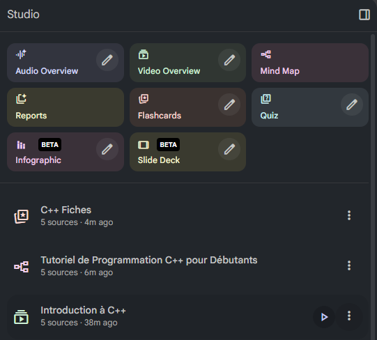
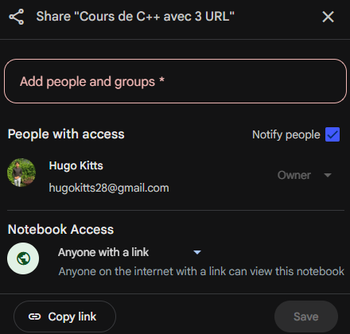

+++
title = "Atelier - NotebookLM"
weight = 20
+++
 
### Créer un cour C++ avec NotebookLM
 
Dans cet atelier nous allons créer un notebook, qui contiendra un cours de C++ créer par l’outils avec l’aide de trois sources, sans aucun fichier en surplus donner à la machine. Nous vous évaluer le niveau d’enseignement que NotebookLM nous offre. Pour ce faire nous allons essayer de créer un cours qui ressemble à celui de cette session en C++. Nous allons demander des informations sur les types, les opérateurs, structure de contrôle et la gestion de mémoire / pointeurs.
 
### Objectifs :
 
- Utiliser NotebookLM avec des sources externes
- Tester les capacités de l’outil à enseigner
- Généré un plan de cours structuré
 
### 1. Création du Notebook :
   À la création du Notebook nous allons donner 3 liens contenants des informations sur C++
 
- https://www.w3schools.com/cpp/default.asp
- https://www.guru99.com/fr/cpp-programming-tutorial.html
- https://www.learncpp.com/
   
 
   
 
Après la création, on peut remarquer qu’une source n’est pas bien importé, il y a une raison pour ce fait. Le site W3Schools empêche automatiquement les robots, scrapers et outils d’indexation de lire ou télécharger leur contenu, y compris NotebookLM, donc nous allons continuer notre cours avec 2 liens.
 
### 2. Générer un plan de cours avec un prompt
   Demander dans le chat : « À partir des sources fournies, génère un plan de cours complet de C++ couvrant les types de données, les opérateurs, les structures de contrôle, la gestion mémoire et les pointeurs. Le plan doit être organisé en modules.» Puis sauvegarder la réponse dans les notes et l’ajouter dans les sources du Notebook.
   
 
   
 
### 3. Générer le contenu de chaque module
   Demander dans le chat : « Développe maintenant tout le contenu complet du plan de cours que nous avons créé précédemment. Ne renvoie pas un plan. Génère du texte d’enseignement détaillé. Pour chaque module et chaque leçon : Rédige des explications pédagogiques complètes basées sur les sources du Notebook. Ajoute du code C++ formaté et expliqué. Ajoute des erreurs fréquentes à éviter. Ajoute un résumé clair à la fin de chaque leçon. Le résultat doit être un cours complet, structuré, clair et fidèle aux sources, et non une liste de titres. » Ajouter les notes de cours aux sources.
 
### 4. Diviser les notes de cours par leur module
   Demander dans le chat : « Avec les notes de cours que nous avons créer donne moi le contenu du Module 1 : Introduction et Fondations de C++.» Vous pouvez ensuite ajouter le module dans les notes du Notebook. Faire ceci pour chaque module du plan de cours
   
 
### 5. Tester votre outil
   Vous pouvez maintenant tester les outils qu'offre NotebookLM. Je vous amène à créer des activités dans le studio comme faire un qui, un audio qui parle du sujet ou une vidéo qui présente le contenu de votre Notebook.
   
 
### 6. Partager votre atelier
   Pour partager il faut ouvrir le Notebook à tout le monde qui on le lien vers ce dernier.
   
 
- https://notebooklm.google.com/notebook/e0479beb-8a1e-4e84-b61f-e9cfa5df3447
 
### Réflexion et analyse
 
Après avoir complété cet atelier, prenez le temps de réfléchir aux questions suivantes :
 
1. Qualité pédagogique : Le contenu généré est-il clair et bien structuré ?
2. Exactitude technique : Les concepts C++ sont-ils correctement expliqués ?
3. Exemples de code : Les exemples fournis sont-ils pertinents et fonctionnels ?
4. Comparaison : Comment ce cours se compare-t-il au cours C++ du site ?
5. Limitations : Quelles sont les limites de l'outil pour créer du contenu pédagogique ?