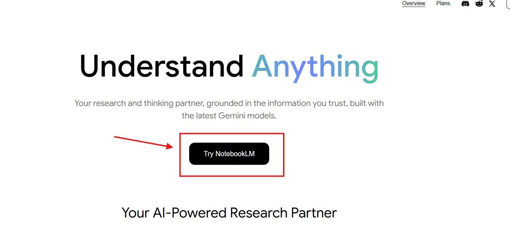
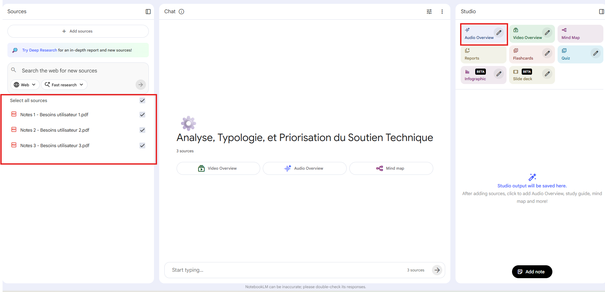
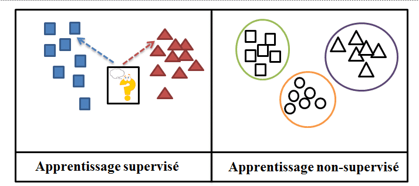
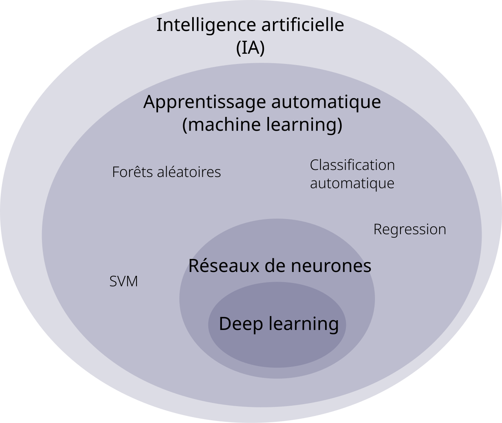

+++
title = "DÉVELOPPEMENT"
weight = 25
+++

### 1.Comment utiliser NotebookLM

Un des points forts de NotebookLM est la facilité d'utilisation. Dans cette section, on va voir comment créer
une vidéo qui va expliquer nos notes de cours comme si c'était un podcast.


 ### 2.tutoriel

 après avoir rechercher NotebookLM dans votre navigateur préféré, vous cliquez sur le premier lien et arriver sur cette interface ou vous trouverez le bouton "Try NotebookLM":

 

 Ensuite on clique sur "Create a new notebook" et vous pourrez ajouter les sources que vous voulez. 
 Dans cet exemple, on va créer une feuille aide-mémoire pour un examen de soutien technique.
 On clique sur "Upload a source" et ensuite on sélectionne les fichiers que l'on veut utiliser.
 Après avoir ajouté vos documents, on va cliquer sur "Audio Overview".

 


 ### 3.Type d’entraînement

D’habitude, quand on parle de LLM, on se fie à deux modèles d’apprentissage : supervisé ou non supervisé.
Dans le cas de NotebookLM, il s’agit d’apprentissage auto-supervisé (self-supervised learning).

 ### 3.1 Apprentissage supervisé

L’apprentissage supervisé consiste à donner au modèle des exemples avec la bonne réponse fournie.
L’IA apprend en comparant sa prédiction avec la réponse humaine.

Exemple :
On montre 15 000 photos de Pokémon étiquetées comme étant de type Eau ou de type Feu.
Ensuite, l’IA apprend à reconnaître elle-même si un nouveau Pokémon est de type Eau ou de type Feu.


### 3.2 Apprentissage non supervisé

Dans l’apprentissage non supervisé, on donne des données sans aucune réponse associée.
L’IA doit trouver des structures ou groupes par elle-même.

Exemple :
On donne des photos de Pokémon sans labels indiquant leur type.
L’IA doit apprendre à créer ses propres catégories en détectant des similarités.


### 3.3 Apprentissage auto-supervisé

L’apprentissage auto-supervisé est une forme d'apprentissage non supervisé :
Il n'a pas besoin de données étiquetées par des humains, le modèle va créer ses propres "étiquettes" à partir des milliers de données qu'on lui donne. Par exemple, on lui donne une phrase simple comme "je veux un verre de ____" :  il devra apprendre à prédire le bon mot manquant. Donc on lui donne des données brutes qu'il devra compléter avec ses propres étiquettes. Cependant, si on veut que notre IA soit plus précise (pour une niche spécifique) au niveau de sa reconnaissance, on va ajouter une étape à l'entrainement: le fine-tuning. Le fine-tuning consiste à passer en mode supervision pour que notre IA soit meilleure pour notre niche.

L’apprentissage auto-supervisé est un entre-deux :
On fournit des données sans labels humains, mais l’IA génère elle-même les “réponses attendues” à partir du contenu.

Exemple :

“Pikachu est un Pokémon de type___.”
L’IA doit deviner électrique.

Dans ce cas, si on veut que notre IA puisse identifier le type de chaque Pokémon avec une image, on devra passer en mode supervision pour qu'elle comprenne bien la différence entre chaque Pokémon.
Elle s’entraîne toute seule en se testant et en corrigeant ses erreurs.


 


### 3.4 l'apprentisage automatique
L’apprentissage auto-supervisé (self-supervised learning, SSL) est basé sur l’apprentissage automatique. L’apprentissage automatique est un champ d’étude de l’intelligence artificielle : il permet aux ordinateurs d’analyser de grandes quantités de données pour y repérer des motifs ou des tendances complexes. Grâce à ce processus, l’IA peut faire des prédictions ou des classifications sur de nouvelles données. Cela permet d’automatiser des tâches complexes sans avoir à programmer manuellement l’IA pour chaque règle ou situation. De nos jours, l'apprentissage automatique est utilisé dans plusieurs domaines, par exemple: pour de la publicité, pour prédire la fluctuation des marchés boursiers ou encore pour la traduction de langues. Souvent, l'apprentissage automatique et l'intelligence artificielle vont être confondus, mais il faut comprendre que l'IA représente l'ensemble des approches qui visent à donner des capacités intellectuelles proches de celles des humains à des machines, alors que l'apprentissage automatique est plus précis. C'est l'usage d'algorithmes et de données pour permettre aux machines de s'améliorer et d'exécuter des tâches sans qu'elles soient programmées pour ces tâches précisément.

 


### 4. Le source-grounding
 
Le source-grounding est un principe qui consiste à ancrer les réponses d’un modèle de langage dans des sources externes fiables plutôt que de se fier uniquement
à ses données d’entraînement.

Lorsque l’utilisateur pose une question, le système fournit au LLM des informations provenant de sources contrôlées (documents, bases de données, API, graphes de connaissances),
afin de réduire les hallucinations et d’améliorer la précision des réponses.

Le source-grounding ne dépend pas d’une technologie unique : les informations peuvent
être récupérées par différents mécanismes selon le type de source utilisé.

### 4.1 La séléction de données

Les systèmes d'IA groundée vont exploiter des informations provenant de plusieurs sources différentes, chacune avec ses propres caractéristiques:

- Internes : des documents et bases de données propres à l'entreprise (contrats, politique, wikis).

- Sources  externes : des sites web publics et des services de données à jour.

-  Données structurées : bases de données SQL, graphes de connaissances et point d'accès API offrant des informations précises et factuelles.

-  Contenue non structuré : documents, courriels et pages web nécessitant un traitement sémantique pour extraire les passages pertinents. 


 Pour gérer les données non structurées, elles vont être "filtrées" par `indexation vectorielle` 

 ```txt
L’indexation vectorielle, c’est quand la machine transforme le texte en valeurs numériques afin de
 représenter son sens, un peu comme un traducteur de langage pour les ordinateurs. 

```


### 4.2 Retrieval-Augmented Generation(RAG)

Le Retrieval-Augmented Generation (RAG) est une implémentation spécifique du
source-grounding. Il combine une étape de recherche automatique d’information
(retrieval) et une étape de génération de texte par un modèle de langage.

Contrairement au source-grounding général, le RAG utilise une recherche vectorielle
pour récupérer dynamiquement les passages les plus pertinents au moment de la requête.

### 4.3 Fonctionnement du Rag
Dans un système RAG, la requête de l’utilisateur est transformée en vecteur sémantique.
Le système compare ce vecteur à ceux des documents stockés dans une base
de données vectorielles afin d’identifier les passages les plus pertinents.
Ces informations sont ensuite injectées dans le prompt du LLM pour générer la réponse.


### 5. Les avantages

L'approche RAG présente plusieurs avantages:

- Les LLM fournissent des réponses précises et à jour: vu que les LLM utilisant RAG utilisent des sources externes et pas seulement ces données d'entrainement, il pourra fournir des réponses claires et à jour.

- Moins de chances de donner de fausses informations ou encore des informations imprécises : en se basant sur les données externes pertinentes, la RAG va réduire le risque de produire des informations fabriquées ou faussées.

- Déployer la RAG est rentable : déployer la RAG ne nécessite pas de personnalisation de modèle. Cela sauve énormément de temps, car les compagnies n'ont pas a réentrainer leurs machines à chaque fois qu'il y a de nouvelles données.


### Source
- https://fr.wikipedia.org/wiki/Apprentissage_automatique
- https://en.wikipedia.org/wiki/Machine_learning
- https://www.ibm.com/think/topics/self-supervised-learning
- https://www.coursera.org/fr-FR/articles/what-is-machine-learning
- https://fr.wikipedia.org/wiki/G%C3%A9n%C3%A9ration_%C3%A0_enrichissement_contextuel
- https://www.oracle.com/fr/artificial-intelligence/generative-ai/retrieval-augmented-generation-rag/
- https://www.databricks.com/fr/glossary/retrieval-augmented-generation-rag
- https://about.you.com/resources/ai-grounding